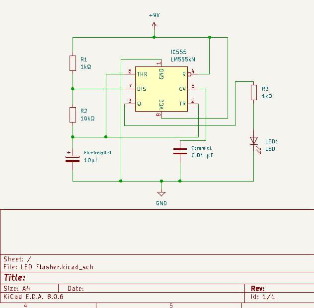
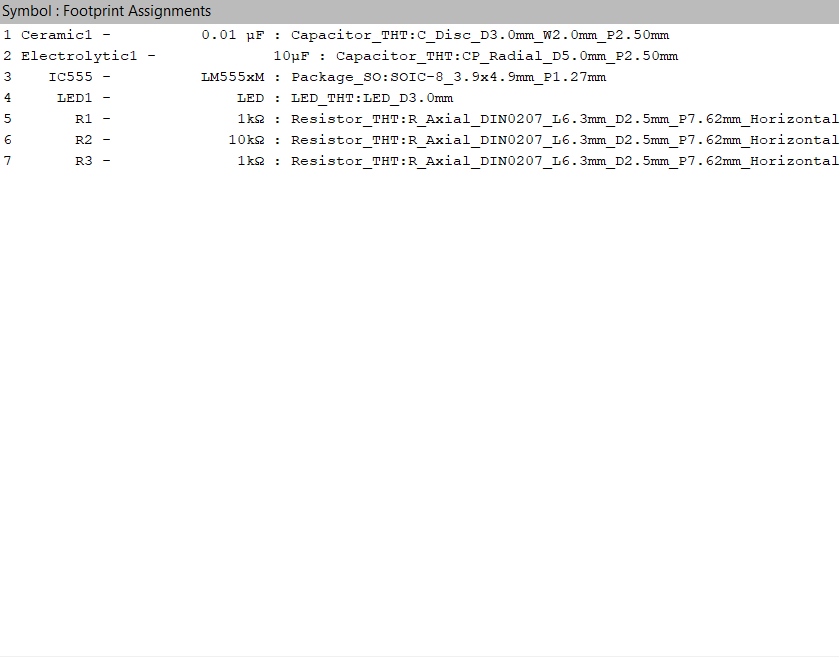
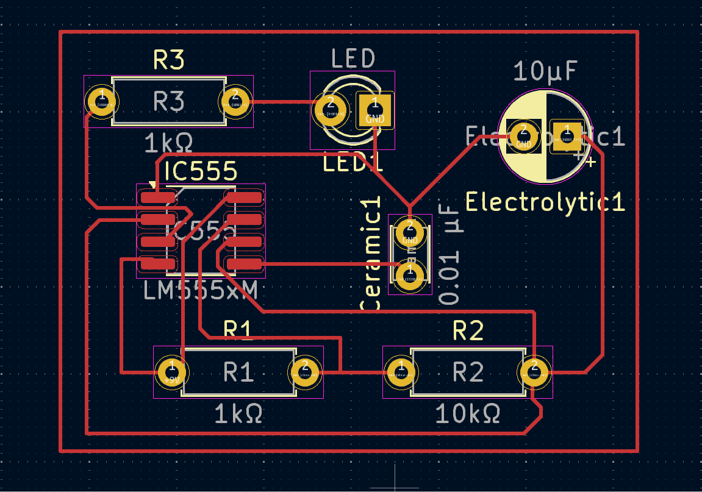
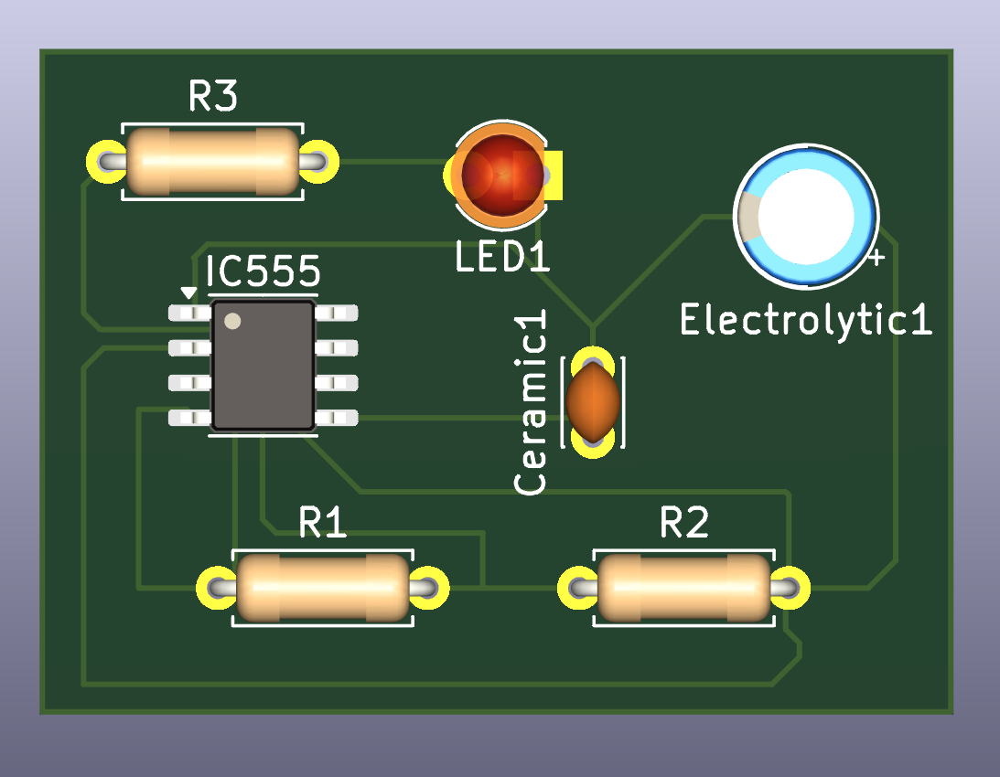

# 555 Astable Multivibrator LED Flasher PCB

An open-source Printed Circuit Board (PCB) designed in KiCad featuring an LM555 timer IC in astable multivibrator mode for pulse-width timing and visual signaling.

---

## Technical Specifications

| Parameter | Specification |
|---|---|
| **Timer IC** | LM555xM (SOIC-8) |
| **Operating Voltage** | 9V DC |
| **Circuit Topology** | Astable Multivibrator |
| **Timing Resistors ($R_1, R_2$)** | $1\text{ k}\Omega,\; 10\text{ k}\Omega$ (Axial DIN0207) |
| **Timing Capacitor ($C_1$)** | $10\text{ }\mu\text{F}$ Electrolytic (Radial) |
| **Bypass Capacitor ($C_2$)** | $0.01\text{ }\mu\text{F}$ Ceramic Disc |
| **Current Limiting Resistor ($R_3$)** | $1\text{ k}\Omega$ (Axial DIN0207) |
| **Output Indicator** | 3 mm Red LED |

---

## Circuit Theory & Operation

The LM555 timer is configured in an astable running mode where output pin 3 continuously toggles between high and low logic states without external triggering.

- **Charge Time ($T_{\text{high}}$):**
  $$T_{\text{high}} = 0.693 \times (R_1 + R_2) \times C_1$$
- **Discharge Time ($T_{\text{low}}$):**
  $$T_{\text{low}} = 0.693 \times R_2 \times C_1$$
- **Total Period ($T$) and Frequency ($f$):**
  $$T = T_{\text{high}} + T_{\text{low}} = 0.693 \times (R_1 + 2R_2) \times C_1$$
  $$f = \frac{1.44}{(R_1 + 2R_2) \times C_1} \approx 6.85\text{ Hz}$$

---

## Schematic

The circuit design was created using standard KiCad component symbols and connected per the astable timing configuration:

---

## Footprint Assignments & Packaging

The board incorporates a hybrid packaging scheme pairing a surface-mount controller with through-hole passive elements:

- **IC555:** `Package_SO:SOIC-8_3.9x4.9mm_P1.27mm`
- **Resistors (R1, R2, R3):** `Resistor_THT:R_Axial_DIN0207_L6.3mm_D2.5mm_P7.62mm_Horizontal`
- **Capacitor C1:** `Capacitor_THT:CP_Radial_D5.0mm_P2.50mm`
- **Capacitor C2:** `Capacitor_THT:C_Disc_D3.0mm_W2.0mm_P2.50mm`
- **LED1:** `LED_THT:LED_D3.0mm`

---

## PCB Layout & Routing

The layout features single-layer copper routing optimized for low trace lengths and practical component spacing:

---

## 3D Render

Physical mechanical clearance and trace isolation verified via KiCad's integrated 3D ray-tracer:

---

## Bill of Materials (BOM)

| Designator | Value | Package | Description |
|---|---|---|---|
| IC1 | LM555xM | SOIC-8 | Single Timer IC |
| R1 | $1\text{ k}\Omega$ | Axial DIN0207 | Timing Resistor |
| R2 | $10\text{ k}\Omega$ | Axial DIN0207 | Timing Resistor |
| R3 | $1\text{ k}\Omega$ | Axial DIN0207 | Current Limiter |
| C1 | $10\text{ }\mu\text{F}$ | Radial D5mm P2.5mm | Timing Capacitor |
| C2 | $0.01\text{ }\mu\text{F}$ | Disc D3mm P2.5mm | Noise Suppression Capacitor |
| LED1 | Red (3 mm) | Through-Hole | Optical Indicator |

---

## License

This hardware design is licensed under the [MIT License](LICENSE).